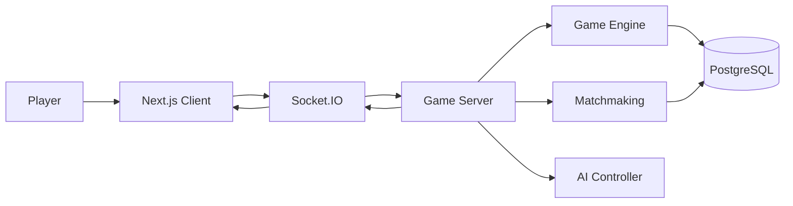
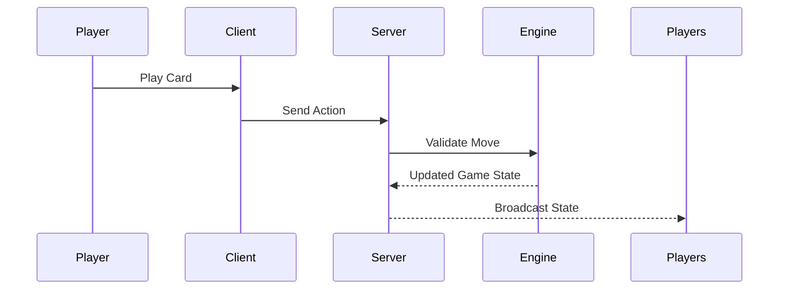

# 🃏 Only Cards

<p align="center">
  <b>A modern real-time multiplayer card-game platform inspired by UNO.</b><br/>
  Fast. Competitive. Server-authoritative. Built for the web.
</p>

<p align="center">
  
  
  
  
  
</p>

<p align="center">
  <a href="https://only-cards-42ch.vercel.app/">
    
  </a>
</p>

---

## Overview

**Only Cards** is a full-stack, real-time multiplayer card-game platform built around competitive UNO-style gameplay.

The project focuses on more than simply reproducing the basic game. It combines a polished web interface with a server-authoritative game engine, real-time multiplayer synchronization, matchmaking, reconnect handling, configurable rule sets and strategic AI opponents.

The goal is to make a browser card game feel closer to a polished multiplayer product than a traditional web-game demo.

---

## ✨ Features

### 🎮 Real-Time Multiplayer

- Real-time gameplay powered by **Socket.IO**
- Server-authoritative game state
- Private rooms
- Matchmaking queues
- Spectator support
- Lobby communication
- Reconnection support
- Player disconnect handling
- Automatic AI substitution for disconnected players

### 🃏 Advanced Card-Game Mechanics

Support for configurable gameplay mechanics including:

- Standard UNO-style rules
- Draw stacking
- Jump-ins
- **7-0 rules**
- Hand swapping
- Turn timers
- Wild-card color selection
- UNO call state
- Custom room configurations

All important moves are validated by the server to prevent clients from directly manipulating game state.

---

## 🤖 Strategic AI Players

Only Cards includes multiple AI play styles designed to behave differently rather than simply selecting random legal cards.

| AI Persona | Behaviour |
|---|---|
| 🧠 **Strategist** | Evaluates threats, probabilities and opponent hands |
| ⚔️ **Aggressive** | Prioritizes attack cards and penalties |
| 🛡️ **Defensive** | Conserves powerful cards and avoids risky plays |
| 🎲 **Chaotic** | Uses intentionally unpredictable decision making |
| 😈 **Troll** | Targets opponents and creates disruptive plays |

The AI system can evaluate factors such as:

- card utility
- opponent threat level
- current hand composition
- penalty opportunities
- strategic wild-card usage
- player danger states

---

## 🎨 Interface

The frontend is designed around a modern game-client aesthetic rather than a traditional webpage.

Highlights include:

- responsive game table
- animated card interactions
- glassmorphism-inspired UI
- smooth transitions
- animated dealing
- hover interactions
- victory effects
- responsive player positioning
- desktop and mobile layouts
- toast-based game notifications

Animations are primarily powered by **Framer Motion**.

## 📝 Feedback Review System

Only Cards includes a local feedback/reporting product for beta testing:

- Players can submit Bug / Glitch, Gameplay issue, UI / Mobile issue, Feature suggestion, or General feedback reports from inside the app.
- Reports are stored in PostgreSQL through Prisma and can include safe diagnostics such as page, device/browser, viewport, room ID, and minimal game state.
- Admins can review, filter, inspect, and update report statuses at `/admin/feedback`.
- Admin access is enforced by the server. Set `ADMIN_USERNAMES` or `ADMIN_USER_IDS` in `.env` to allow specific owners. In local non-production runs, the built-in `admin` account is allowed automatically.


---

## 🔊 Dynamic Audio

Instead of depending entirely on static sound assets, the project can generate game feedback using the browser's **Web Audio API**.

Examples include:

- card interactions
- warning sounds
- game-state feedback
- victory cues
- defeat cues
- interface feedback

---

## 🏗️ Architecture

```text
Only Cards
│
├── client/
│   └── Next.js frontend
│
├── server/
│   ├── Express API
│   ├── Socket.IO realtime server
│   ├── Game engine
│   ├── Matchmaking
│   ├── AI controllers
│   └── Prisma
│
├── shared/
│   └── Shared TypeScript models and types
│
└── docker-compose.yml
```

The project is structured as a multi-package application with shared TypeScript definitions between the frontend and backend.

---

## ⚙️ Tech Stack

### Frontend

- **Next.js**
- **React**
- **TypeScript**
- **Tailwind CSS**
- **Framer Motion**
- **Zustand**
- **canvas-confetti**

### Backend

- **Node.js**
- **Express**
- **Socket.IO**
- **TypeScript**

### Database

- **PostgreSQL**
- **Prisma ORM**

### Infrastructure

- **Docker**
- **Docker Compose**
- **GitHub Actions**

---

## 🔐 Server-Authoritative Gameplay

The client never becomes the source of truth for a match.

Actions such as:

```text
PLAY CARD
DRAW CARD
PASS TURN
CALL UNO
SWAP HAND
SELECT WILD COLOR
```

are validated by the backend before the game state is updated.

This architecture reduces opportunities for client-side manipulation and keeps multiplayer sessions synchronized.

---

## 🔄 Reconnection System

Multiplayer games should not immediately collapse when a player temporarily disconnects.

Only Cards includes reconnect handling that can:

1. Detect disconnected players
2. Preserve the active match
3. Temporarily replace disconnected players with AI
4. Synchronize the returning client
5. Restore the player into the running match

This allows matches to continue instead of permanently stalling.

---

## 🧩 Multiplayer Flow



---

## 🧠 Game Action Flow



---

## 📈 Scalability

The current architecture supports a single real-time server instance.

For horizontal scaling, the Socket.IO layer can be extended using:

```text
Redis
Socket.IO Redis Adapter
Load Balancer
Multiple Game Server Instances
```

A production architecture could look like:

```text
                  Load Balancer
                        │
           ┌────────────┼────────────┐
           │            │            │
      Game Server   Game Server   Game Server
           │            │            │
           └────────────┼────────────┘
                        │
                       Redis
                        │
                    PostgreSQL
```

---

## 🔒 Security Considerations

The project includes or is designed around:

- JWT-based authentication
- server-side game validation
- configurable allowed origins
- backend-controlled room state
- environment-based secrets
- PostgreSQL persistence
- secure password hashing
- rate-limiting architecture
- input and game-action validation

> Never commit `.env` or production credentials to the repository.

---

## 🗺️ Roadmap

Future improvements may include:

- [ ] Ranked matchmaking
- [ ] Player statistics
- [ ] Leaderboards
- [ ] Seasonal ranking
- [ ] Friend system
- [ ] Match history
- [ ] Custom avatars
- [ ] Tournament mode
- [ ] Persistent player progression
- [ ] Redis-backed multiplayer scaling
- [ ] Additional card-game modes
- [ ] Improved spectator tools

---

## 📸 Screenshots

> Screenshots and gameplay previews will be added as the interface evolves.

<!--
Example:

<p align="center">
  
</p>
-->

---

## 🌐 Live Deployment

<p align="center">
  <a href="https://only-cards-42ch.vercel.app/">
    
  </a>
</p>

<p align="center">
  Experience the live multiplayer version of <b>Only Cards</b>.
</p>

---

## 👨‍💻 Author

**Akshay Wesley**

Building projects across full-stack development, AI and interactive web experiences.

[](https://github.com/akshaywesleykothapalli)

---

<p align="center">
  <b>Built for competitive card-game nights.</b>
</p>

<p align="center">
  🃏 Draw. Play. Reverse. Repeat.
</p>
